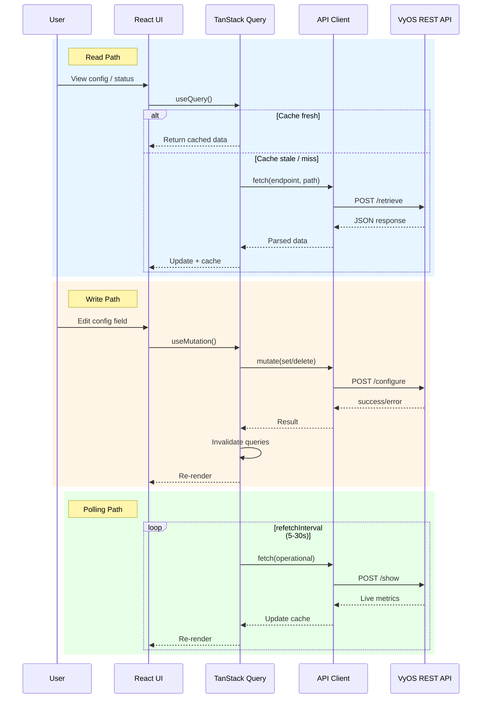
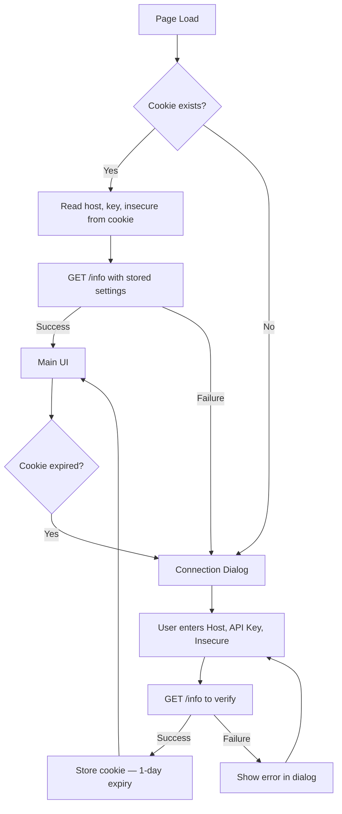
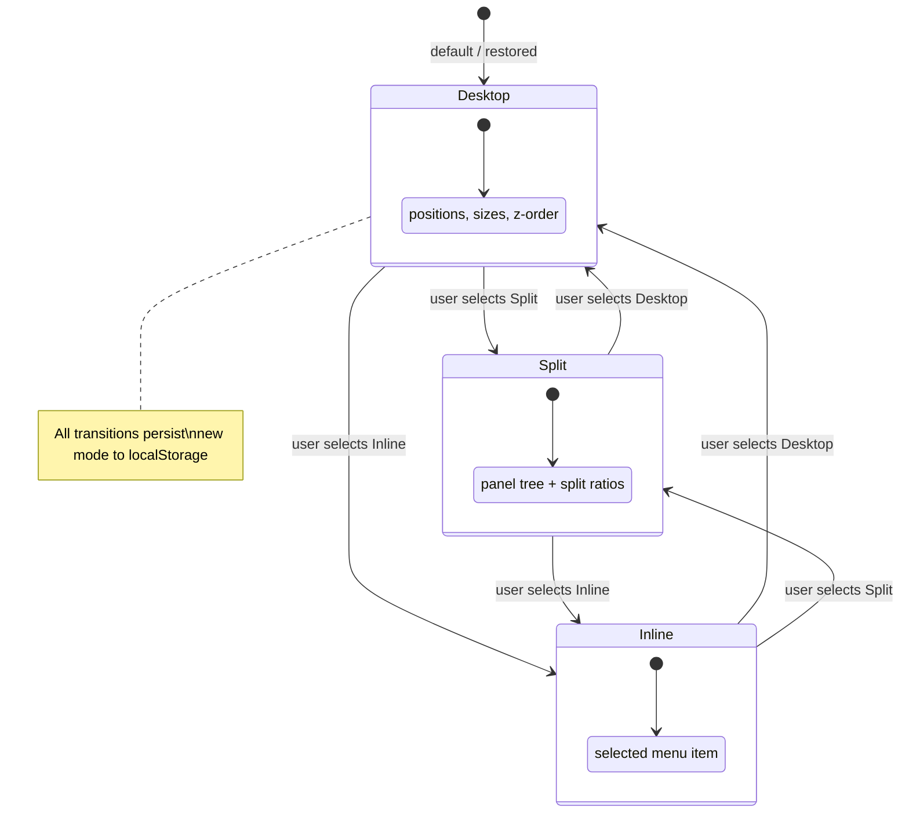
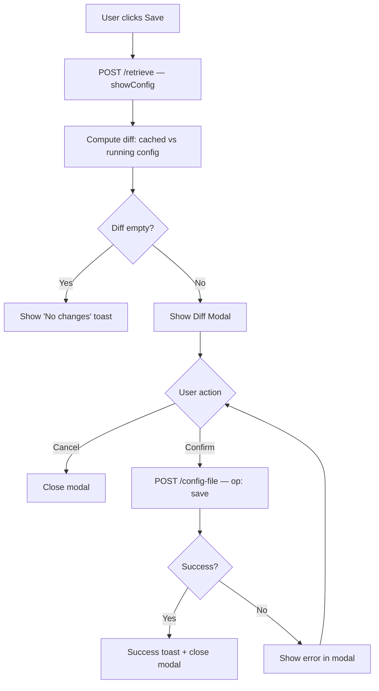
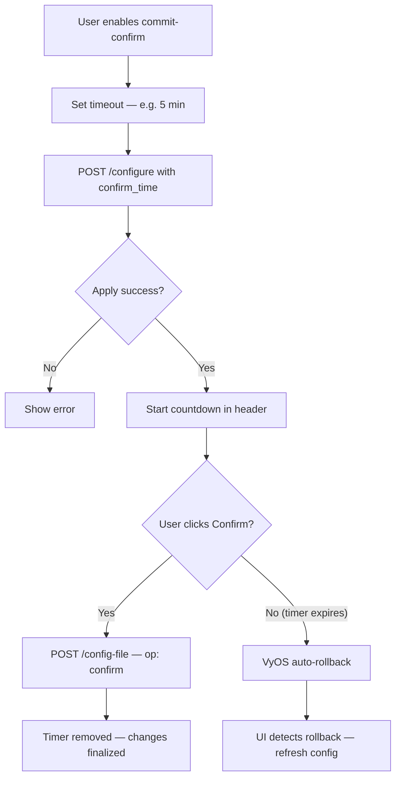
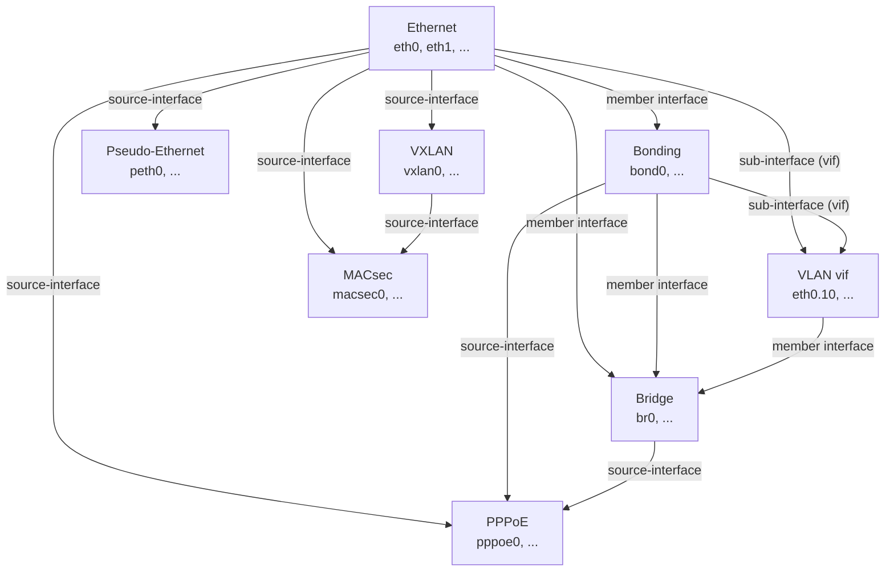

# VyManage - Specification

## 1. Overview

VyManage is a web-based management interface for VyOS routers, communicating exclusively through the VyOS REST API (`/retrieve`, `/configure`, `/config-file`, `/show`, `/generate`, `/reset`). It provides an admin-console experience with a windowed desktop metaphor, split/dock mode, and inline mode for managing the full VyOS configuration tree.

---

## 2. Tech Stack

| Layer | Technology |
|-------|-----------|
| Framework | Next.js (static export / SSG) |
| Language | TypeScript (strict) |
| Data fetching | TanStack Query (React Query) |
| Styling | Tailwind CSS |
| Component library | shadcn/ui |
| Drag & drop | react-dnd |
| Diffing | diff (or similar) for config diff display |
| Monorepo | Turborepo |
| Unit / Integration testing | Vitest |
| Component testing | @testing-library/react |
| E2E testing | Playwright |

---

## 3. Architecture

### 3.1 Static Export

The app is built as a static Next.js export. All VyOS communication happens client-side via the REST API. There is no server-side component beyond serving the static assets.

### 3.2 API Communication Layer

A shared API client module wraps all VyOS REST API calls:

| VyOS Endpoint | Method | Purpose |
|---------------|--------|---------|
| `GET /info` | Public | Connectivity check, version info |
| `POST /retrieve` | `showConfig` | Fetch full or partial config as JSON |
| `POST /retrieve` | `returnValues` | Fetch multi-value nodes |
| `POST /retrieve` | `exists` | Check if a config path exists |
| `POST /configure` | `set` / `delete` | Modify configuration (auto-commits) |
| `POST /config-file` | `save` / `load` / `merge` / `confirm` | File operations and commit-confirm |
| `POST /show` | Operational | Show operational data (metrics, status) |
| `POST /generate` | Generate | Key/cert generation |
| `POST /reset` | Reset | Reset connections/protocols |
| `POST /reboot` | System | Reboot device |
| `POST /poweroff` | System | Power off device |
| `POST /image` | Image | Add/delete system images |

All requests send the API key via the `key` field. Paths are sent as string arrays (e.g., `["interfaces", "ethernet", "eth0"]`).

### 3.3 Data Flow



- **Reads**: TanStack Query manages caching, background refetching, and stale data.
- **Writes**: Mutations invalidate relevant queries on success.
- **Polling**: Operational/metrics queries use `refetchInterval` for live data.

---

## 4. Authentication & Session

### 4.1 Flow

1. On first visit (no valid cookie), show a connection dialog:
   - Fields: **Host URL**, **API Key**, **Insecure** checkbox
   - The **Insecure** checkbox, when ticked, uses `http://` instead of `https://` for all API communication. When unticked (default), all traffic uses `https://`.
   - The host field accepts a hostname or IP (with optional port). The protocol prefix is determined by the insecure toggle, not typed by the user.
2. On submit, call `GET /info` on the constructed URL to verify connectivity.
3. On success, store `{ host, key, insecure }` in a cookie with a **1-day expiry**.
4. On subsequent visits, read the cookie, verify with `/info` using the stored protocol preference, and proceed to the main UI.
5. On failure (expired cookie, unreachable host), re-prompt the connection dialog.



```
+--------------------------------------------------+
|              Connect to VyOS Device               |
|--------------------------------------------------|
|                                                  |
|  Host          [_______________________]         |
|                                                  |
|  API Key       [_______________________]         |
|                                                  |
|  [ ] Insecure (use HTTP)                         |
|  ⚠ Warning: API key will be sent unencrypted     |
|    (shown only when checkbox is ticked)           |
|                                                  |
|                          [ Connect ]             |
|                                                  |
|  ┌─── Error ──────────────────────────┐          |
|  │ Connection failed: unreachable     │          |
|  └────────────────────────────────────┘          |
+--------------------------------------------------+
```

### 4.2 Security Considerations

- The API key grants full access to the VyOS device (no granular permissions in VyOS).
- When using HTTPS (default): cookies use `Secure` and `SameSite=Strict` attributes.
- When using HTTP (insecure mode): cookies omit the `Secure` flag. A visible warning banner is shown in the header indicating the connection is unencrypted.
- Insecure mode is intended for lab/development environments or cases where TLS terminates upstream.

---

## 5. Application Layout

```
+------------------------------------------------------------------+
| +----------+ +------------------------------------------------+ |
| |  ☰ Menu  | | 🖥 vyos-router  |  v1.4.0  |  ● Connected     | |
| |----------| | [Save] [Mode: Desktop ▾]            [⏱ --:--]  | |
| | Dashboard| +------------------------------------------------+ |
| | Interfac.| +------------------------------------------------+ |
| | Firewall | |                                                | |
| | NAT      | |                 Workspace                      | |
| | Routing  | |                                                | |
| | Policy   | |   (Desktop: floating windows)                  | |
| | VPN      | |   (Split: tiled panels)                        | |
| | Services | |   (Inline: single panel)                       | |
| | QoS      | |                                                | |
| | HA       | |           → See Section 6                      | |
| | Load Bal.| |                                                | |
| | Containe.| |                                                | |
| | PKI      | +------------------------------------------------+ |
| | VRF      | | [Interfaces] [Firewall] [NAT]       Taskbar    | |
| | System   | | (desktop mode only — see §6.1)                 | |
| | Operatio.| +------------------------------------------------+ |
| |----------| §5.1 Sidebar    §5.2 Header                      |
| | ⚙ Prefs  | §5.3 Workspace  §5.4 Profile/Settings            |
| +----------+                                                    |
+------------------------------------------------------------------+
```

### 5.1 Menu Sidebar

- Collapsible left-hand navigation panel.
- **Single-level menu only** — no nested submenus or expandable groups. Each entry is a top-level item.
- Subitems are presented as **tabs within the opened panel** (see Section 8).
- Collapse/expand toggle (icon-only when minimized).
- Displays icons and labels for each section.

### 5.2 Header Bar

- Shows current device hostname, connection status, VyOS version.
- Save/commit button with diff preview workflow.
- Screen mode toggle (Desktop / Split / Inline).

### 5.3 Workspace

- Central content area where configuration panels are rendered.
- Behavior changes based on selected screen mode (see Section 6).
- Custom stylized scrollbars throughout.

### 5.4 Profile / Settings

- Located below the sidebar menu.
- Connection settings (host, key), UI preferences, screen mode selection.

---

## 6. Screen Management Modes

Three mutually exclusive workspace modes. Selection and all window states persist in `localStorage`.



### 6.1 Desktop Mode

A windowed desktop metaphor inside the workspace area.

| Feature | Behavior |
|---------|----------|
| Window creation | Clicking a menu item opens a new window in the workspace |
| Window header | Icon + name (left), minimize / maximize / close buttons (right) |
| Window resize | All windows are freely resizable by dragging edges/corners |
| Window focus | Clicking a window brings it to front (z-index management) |
| Window drag | Windows are freely draggable; dragging beyond bounds expands the workspace |
| Taskbar | Horizontal bar below the workspace showing all open windows; click to focus/restore |
| Zoom override | Intercept `Ctrl+scroll` and touch pinch gestures for workspace zoom (not browser zoom) |
| Scrollbars | Workspace always shows scrollbars; workspace canvas grows as windows are dragged outward |

```
+------------------------------------------------------------+
| Workspace (scrollable canvas)                              |
|                                                            |
|  ┌─ Interfaces ──────────────┐                             |
|  │ 🖥 Interfaces   [_ ▢ ✕]  │  ┌─ Firewall ────────────┐ |
|  │                           │  │ 🛡 Firewall   [_ ▢ ✕] │ |
|  │  eth0  192.168.1.1  UP   │  │                        │ |
|  │  eth1  10.0.0.1     UP   │  │  Rule 10  accept  ...  │ |
|  │  bond0 172.16.0.1   UP   │  │  Rule 20  drop    ...  │ |
|  │                           │  │  Rule 30  accept  ...  │ |
|  └───────────────────────────┘  │                        │ |
|                                 └────────────────────────┘ |
|        ┌─ NAT ──────────────────────────┐                  |
|        │ 🔀 NAT           [_ ▢ ✕]      │                  |
|        │                                │                  |
|        │  SNAT Rule 10  masquerade ...  │                  |
|        └────────────────────────────────┘                  |
|                                                            |
+------------------------------------------------------------+
| [🖥 Interfaces] [🛡 Firewall] [🔀 NAT]       Taskbar     |
+------------------------------------------------------------+
```

### 6.2 Split / Dock Mode

A tiling window manager where panels split the available space.

| Feature | Behavior |
|---------|----------|
| Initial state | First menu item fills the full workspace |
| Splitting | Dragging a window header onto another panel splits that panel; split direction is determined by proximity to the nearest border of the drop target |
| Recalculation | On any split/move, all panels recalculate to fill available space |
| Border resize | Panel borders are draggable to resize adjacent panels |
| Window header | Menu name + close button only (no min/max) |
| Close behavior | Closing a panel causes adjacent panels to reclaim the freed space |

```
+------------------------------------------------------------+
|  Interfaces          ✕ || Firewall              ✕         |
|                        ||                                  |
|  eth0 192.168.1.1  UP  ||  Rule 10  accept  established   |
|  eth1 10.0.0.1    UP  ||  Rule 20  drop     any          |
|  bond0 172.16.0.1 UP  ||  Rule 30  accept   icmp         |
|                        ||                                  |
|  ← drag border →      ||                                  |
|========================||==================================|
|  NAT                ✕ || BGP Neighbors          ✕        |
|                        ||                                  |
|  SNAT Rule 10         ||  10.0.0.2  AS65001  Established  |
|  masquerade  eth0     ||  10.0.0.3  AS65002  Active       |
|                        ||                                  |
+------------------------------------------------------------+
  ↑ draggable borders (|| = vertical, === = horizontal)
```

### 6.3 Inline Mode

A traditional single-page view.

| Feature | Behavior |
|---------|----------|
| Display | Only the currently selected menu item is shown |
| Navigation | Selecting a new menu item replaces the current view |
| Scrolling | Only the workspace area scrolls (sidebar and header remain fixed) |
| No window chrome | No drag handles, title bars, or window management UI |

```
+----------+---------------------------------------------+
| ☰ Menu   |  Interfaces                                 |
|----------|---------------------------------------------|
| Dashbrd  |  [Ethernet] [Bond] [Bridge] [VLAN] [All]   |
| Interfac.|---------------------------------------------|
|  ← active|                                             |
| Firewall |  Name    Type      Address        Status    |
| NAT      |  eth0    Ethernet  192.168.1.1/24   UP     |
| Routing  |  eth1    Ethernet  10.0.0.1/24      UP     |
| Policy   |  bond0   Bonding   172.16.0.1/24    UP     |
| VPN      |    └ eth2          (member)         UP     |
| Services |    └ eth3          (member)         UP     |
| QoS      |  br0     Bridge    192.168.50.1/24  UP     |
| HA       |                                             |
| Load Bal.|  (full-width, no window chrome)             |
| ...      |                                             |
+----------+---------------------------------------------+
  No taskbar in inline mode
```

### 6.4 State Persistence

All mode-specific state is stored in `localStorage`:
- Current mode selection.
- Desktop mode: window positions, sizes, z-order, minimized/maximized state.
- Split mode: panel layout tree with split ratios.
- Inline mode: currently selected menu item.

---

## 7. Configuration Save / Commit Workflow

### 7.1 Save Flow

1. User clicks **Save**.
2. App fetches the latest running config from VyOS via `POST /retrieve` (`showConfig`).
3. App computes a diff between the previously loaded config and the current running config.
4. Diff is displayed in a modal with syntax-highlighted additions/deletions.
5. User reviews and confirms.
6. App sends `POST /config-file` with `{ "op": "save" }`.



```
+------------------------------------------------------+
|              Review Configuration Changes             |
|------------------------------------------------------|
|                                                      |
|  interfaces {                                        |
|      ethernet eth0 {                                 |
| -        address 192.168.1.1/24                      |
| +        address 10.0.0.1/24                         |
|      }                                               |
|  }                                                   |
|  firewall {                                          |
|      name WAN_IN {                                   |
| +        rule 25 {                                   |
| +            action accept                           |
| +            protocol tcp                            |
| +            destination port 443                    |
| +        }                                           |
|      }                                               |
|  }                                                   |
|                                                      |
|  [ ] Enable commit-confirm  Timeout: [5] min        |
|                                                      |
|                      [ Cancel ]  [ Confirm & Save ]  |
+------------------------------------------------------+
```

### 7.2 Commit-Confirm Flow

1. Changes are sent to `/configure` with a `confirm_time` (e.g., 5 minutes).
2. A countdown timer is displayed in the header.
3. User can click **Confirm** to finalize (`POST /config-file` with `{ "op": "confirm" }`).
4. If the timer expires without confirmation, VyOS automatically rolls back.



```
+------------------------------------------------------------+
| 🖥 vyos-router  |  v1.4.0  |  ● Connected                 |
| ⚠ Commit-confirm active: [ 3:42 remaining ] [ Confirm ]   |
+------------------------------------------------------------+
  ↑ Header bar during commit-confirm — amber background
    Timer counts down. Confirm button finalizes changes.
    If timer reaches 0:00, VyOS rolls back automatically.
```

---

## 8. Menu Structure & Configuration Panels

The sidebar menu is a **flat, single-level list**. There are no nested submenus or expandable groups. Each menu item opens a panel; sub-sections within that domain are presented as **tabs inside the panel**.

### 8.1 Sidebar Menu Items

| Menu Item | Panel Tabs |
|-----------|-----------|
| Interfaces | *(Unified table — see Section 8.3)* |
| Firewall | IPv4 Rules, IPv6 Rules, Bridge Rules, Groups, Zones, Flow Tables, Global Options |
| NAT | NAT44 (Source / Destination), NAT64, NAT66, CGNAT |
| Routing / Protocols | Static Routes, BGP, OSPF, OSPFv3, ISIS, RIP, Babel, BFD, MPLS, Segment Routing, IGMP Proxy, PIM / PIM6, Multicast, RPKI, Failover |
| Policy | Route Maps, Access Lists, Prefix Lists, AS Path Lists, Community Lists, Ext Community Lists, Large Community Lists, Local Route |
| VPN | IPsec (Site-to-Site), IPsec (Remote Access), DMVPN, L2TP, OpenConnect, PPTP, SSTP |
| Services | DHCP Server, DHCPv6 Server, DHCP Relay, DNS, SSH, HTTPS / API, NTP, SNMP, LLDP, PPPoE Server, IPoE Server, Monitoring, Sflow, Flow Accounting, Config Sync, Conntrack Sync, Router Advertisements, Multicast DNS, Event Handler, Broadcast Relay, TFTP Server, Web Proxy, Suricata (IDS/IPS), Console Server |
| Traffic Policy / QoS | Shaper (HTB), Priority Queue, Round Robin, Random Detect, CAKE, FQ-CoDel, Fair Queue, Drop Tail, Rate Control, Limiter (Ingress), Network Emulator |
| High Availability | VRRP, Virtual Server |
| Load Balancing | WAN, HAProxy (Reverse Proxy) |
| Containers | Containers, Networks, Registries |
| PKI | Certificate Authority, Certificates, Key Pairs, DH Parameters |
| VRF | VRF Instances |
| System | Host Name / Domain, DNS / Name Servers, Time Zone / NTP, Login / Users, Syslog, Conntrack, IP / IPv6 Settings, Console, Task Scheduler, Watchdog, Options, Acceleration, Updates, Image Management |
| Operations | System Info, Reboot / Poweroff, Show Commands (freeform) |

### 8.2 Interfaces Panel — Unified Table with Tree View

The Interfaces panel does **not** use the standard tab bar. Instead, it displays a **single unified table** listing all configured interfaces across all types.

#### Table Columns

| Column | Content |
|--------|---------|
| Name | Interface name (e.g., `eth0`, `bond0`, `br0`) |
| Type | Interface type icon + label (Ethernet, Bridge, Bond, etc.) |
| Status | Link state (up/down), from operational data |
| Address | Configured IP address(es) |
| Description | User-set description |
| VRF | VRF membership (if any) |
| Actions | Edit, Delete |

#### Tree Structure

Interfaces that are bound to a parent are rendered as **indented children** under their parent row. The tree is collapsible.

Parent-child relationships displayed in the tree:

| Parent Type | Child Type | Binding Field |
|-------------|------------|---------------|
| Ethernet / Bonding | VLAN (vif) | Sub-interface (e.g., `eth0.10`) |
| Bonding | Ethernet | `member interface` |
| Bridge | Ethernet, Bonding, VLAN | `member interface` |
| Any physical/bond/bridge | PPPoE | `source-interface` |
| Any physical | Pseudo-Ethernet | `source-interface` |
| Any physical / VXLAN | MACsec | `source-interface` |
| Any physical / Dummy | VXLAN | `source-interface` |

Unbound interfaces (Loopback, Dummy, Tunnel, WireGuard, OpenVPN, VTI, GENEVE, L2TPv3, Virtual-Ethernet, Wireless, WWAN, SSTP Client) appear as top-level rows.



#### Toolbar

A toolbar above the table provides:
- A **type filter** dropdown to show/hide interface types.
- A **search** field to filter by name, address, or description.
- An **Add Interface** button that opens a type selector, then the creation form.

Clicking any interface row opens its **detail/edit panel** (type-specific form for that interface).

```
+------------------------------------------------------------+
| Interfaces                                                 |
|------------------------------------------------------------|
| [Type: All ▾]  [🔍 Search____________]  [+ Add Interface] |
|------------------------------------------------------------|
| ▸ Name       Type       Address          Status  VRF  Act |
|------------------------------------------------------------|
| ▾ bond0      Bonding    172.16.0.1/24    UP      —    ✎ 🗑|
|   └ eth2     Ethernet   (member)         UP      —    ✎ 🗑|
|   └ eth3     Ethernet   (member)         UP      —    ✎ 🗑|
| ▾ br0        Bridge     192.168.50.1/24  UP      —    ✎ 🗑|
|   └ eth4     Ethernet   (member)         UP      —    ✎ 🗑|
|   └ bond0    Bonding    (member)         UP      —    ✎ 🗑|
| ▾ eth0       Ethernet   192.168.1.1/24   UP      —    ✎ 🗑|
|   └ eth0.10  VLAN       10.0.10.1/24     UP      —    ✎ 🗑|
|   └ eth0.20  VLAN       10.0.20.1/24     UP      —    ✎ 🗑|
|   └ pppoe0   PPPoE      (dynamic)        UP      —    ✎ 🗑|
|   eth1       Ethernet   10.0.0.1/24      UP      —    ✎ 🗑|
|   lo         Loopback   127.0.0.1/8      UP      —    ✎ 🗑|
|   wg0        WireGuard  10.10.0.1/24     UP      —    ✎ 🗑|
+------------------------------------------------------------+
  ▾/▸ = expand/collapse tree    ✎ = edit    🗑 = delete
```

### 8.3 Cross-Reference Lookups

Any configuration field that references another named object in the system renders as a **searchable combobox dropdown** instead of a free-text input. This is a global UX pattern applied across all configuration panels.

#### Behavior

- On focus, fetches the list of valid targets from the API (e.g., all interface names, all firewall rule-set names).
- Supports type-ahead filtering.
- Shows the target's type/description alongside the name for disambiguation.
- Allows free-text entry as a fallback (VyOS may have objects not yet created).
- Groups results by category when multiple types are valid (e.g., interface lookup groups by Ethernet, Bond, Bridge, etc.).

```
  Inbound Interface  [eth_____________|▾]
                     +------------------------------+
                     | ── Ethernet ──────────────── |
                     |   eth0    192.168.1.1   UP   |
                     |   eth1    10.0.0.1      UP   |
                     |   eth2    (bond member)  UP   |
                     | ── Bonding ───────────────── |
                     |   bond0   172.16.0.1    UP   |
                     | ── Bridge ────────────────── |
                     |   br0     192.168.50.1  UP   |
                     |─────────────────────────────-|
                     | ℹ Type a name not listed     |
                     |   above to use free-text     |
                     +------------------------------+
  ↑ Searchable combobox with type-ahead "eth" typed.
    Results grouped by interface type.
    Free-text fallback for not-yet-created objects.
```

#### Cross-Reference Fields

| Config Area | Field | Lookup Target |
|-------------|-------|---------------|
| Firewall rules | `inbound-interface name` | Interfaces |
| Firewall rules | `outbound-interface name` | Interfaces |
| Firewall rules | `inbound-interface group` | Firewall interface groups |
| Firewall rules | `outbound-interface group` | Firewall interface groups |
| Firewall rules | `source group address-group` | Firewall address groups |
| Firewall rules | `source group port-group` | Firewall port groups |
| Firewall rules | `destination group address-group` | Firewall address groups |
| Firewall rules | `destination group port-group` | Firewall port groups |
| Firewall zones | `interface` | Interfaces |
| Firewall zones | `from <zone> firewall name` | Firewall IPv4 rule sets |
| Firewall zones | `from <zone> firewall ipv6-name` | Firewall IPv6 rule sets |
| NAT rules | `inbound-interface name` | Interfaces |
| NAT rules | `outbound-interface name` | Interfaces |
| NAT rules | `inbound-interface group` | Firewall interface groups |
| NAT rules | `outbound-interface group` | Firewall interface groups |
| QoS | `qos interface <name>` | Interfaces |
| QoS | `egress` / `ingress` policy | Traffic policies (by name) |
| BGP neighbor | `route-map import` / `export` | Route maps |
| BGP neighbor | `prefix-list` | Prefix lists |
| BGP | `address-family ... route-map` | Route maps |
| OSPF | `interface` | Interfaces |
| Policy route-maps | `match ip address prefix-list` | Prefix lists |
| Policy route-maps | `match as-path` | AS path lists |
| Policy route-maps | `match community` | Community lists |
| Policy route-maps | `match large-community` | Large community lists |
| Policy route-maps | `match ip next-hop prefix-list` | Prefix lists |
| IPsec | `ike-group` | IKE groups |
| IPsec | `esp-group` | ESP groups |
| IPsec | `local-address` / interface | Interfaces |
| VRRP | `interface` | Interfaces |
| DHCP server | `listen-interface` | Interfaces |
| PPPoE / VXLAN / MACsec / Pseudo-Ethernet | `source-interface` | Interfaces |
| Any interface | `vrf` | VRF instances |
| Bridge | `member interface` | Interfaces (Ethernet, Bond) |
| Bonding | `member interface` | Interfaces (Ethernet) |
| Containers | `network` | Container networks |
| Load Balancing (WAN) | interface health checks | Interfaces |

### 8.4 Panel Design Principles

- Clicking a sidebar menu item opens the panel. The panel renders a **tab bar** across the top with all sub-sections for that domain.
- The first tab is selected by default. The active tab is persisted per-panel in `localStorage`.
- Each tab maps to a VyOS config path (e.g., Interfaces > Ethernet = `["interfaces", "ethernet"]`).
- Tab content fetches its config subtree on selection via `POST /retrieve` with `showConfig` and the relevant path.
- Forms are generated from the config schema; fields map to `set` / `delete` operations.
- Where VyOS has ordered lists (firewall rules, NAT rules, policy rules), display as tables with **drag-and-drop reordering** via react-dnd to rearrange rule numbers.
- Where appropriate, tabs include an operational data section using `POST /show` with polling (e.g., interface stats, BGP neighbor status, VRRP state).

```
+------------------------------------------------------------+
| Firewall                                                   |
| [IPv4 Rules] [IPv6 Rules] [Groups] [Zones] [Global Opts]  |
|          ↑ active tab                                      |
|------------------------------------------------------------|
| IPv4 Rule Set: [WAN_IN ▾]          [+ Add Rule]           |
|------------------------------------------------------------|
| ≡  #    Action   Protocol  Source       Dest       Hits    |
|------------------------------------------------------------|
| ≡  10   accept   tcp/est   any          any        14,230  |
| ≡  20   accept   tcp       10.0.0.0/8   any:443    3,891  |
| ≡  30   accept   icmp      any          any        1,204  |
| ≡  40   drop     any       any          any        8,477  |
|------------------------------------------------------------|
| ≡ = drag handle for reorder (react-dnd)                    |
|                                                            |
| ── Operational Data ─────────── 🔄 polling: 10s ───────── |
| Rule hit counters last updated: 2 seconds ago              |
| Total packets matched: 27,802                              |
| Default action: drop (4,112 hits)                          |
+------------------------------------------------------------+
```

---

## 9. Operational Data & Metrics

Alongside configuration panels, relevant operational data is fetched via `POST /show` and displayed in-context.

| Config Section | Operational Data | Polling |
|---------------|------------------|---------|
| Interfaces | Interface statistics, link state, IP addresses | 5s |
| Firewall | Rule hit counters | 10s |
| BGP | Neighbor status, route counts | 10s |
| OSPF | Neighbor adjacencies, LSDB summary | 10s |
| VRRP | Group state (master/backup), priority | 5s |
| DHCP Server | Active leases | 30s |
| IPsec | Tunnel status, SA info | 10s |
| WireGuard | Peer status, handshake times, transfer stats | 5s |
| Conntrack | Connection count, table usage | 10s |
| System | Uptime, CPU, memory, disk (via show commands) | 10s |
| Containers | Container status, resource usage | 10s |
| Load Balancer | Backend health, connection counts | 5s |

Polling intervals are configurable per-panel. A global pause/resume toggle is available in the header.

---

## 10. Drag & Drop (react-dnd)

Used in the following contexts:

1. **Ordered rule tables**: Firewall rules, NAT rules, policy entries, QoS classes, access-list entries. Drag to reorder; on drop, the app computes the necessary `delete` + `set` operations to renumber.
2. **Desktop mode windows**: Drag window headers to reposition.
3. **Split/dock mode panels**: Drag panel headers to split/rearrange.

---

## 11. Scrollbar Styling

All scrollable containers use custom-styled scrollbars via Tailwind CSS utilities:
- Thin track with rounded thumb.
- Themed to match the shadcn/ui color scheme (muted background, accent thumb).
- Workspace area in desktop mode always shows scrollbars (both axes).

---

## 12. Deployment

### 12.1 Docker

```dockerfile
# Multi-stage build
FROM node:20-alpine AS builder
WORKDIR /app
COPY . .
RUN npm ci && npm run build

FROM nginx:alpine
COPY --from=builder /app/out /usr/share/nginx/html
COPY nginx.conf /etc/nginx/nginx.conf
EXPOSE 80 443
```

The static export is served by nginx inside the container.

### 12.2 Configuration

| Env Variable | Purpose | Default |
|-------------|---------|---------|
| `VYMANAGE_DEFAULT_HOST` | Pre-fill the host field in connection dialog | (none) |

### 12.3 Usage Instructions

```bash
docker build -t vymanage .
docker run -d -p 8080:80 vymanage
```

Then navigate to `http://localhost:8080`. The connection dialog will prompt for the VyOS host and API key.

---

## 13. Project Structure

Turborepo monorepo with shared packages for UI components, the VyOS API client, and shared configuration.

```
vymanage/
├── apps/
│   └── web/                          # Next.js app (static export)
│       ├── src/
│       │   ├── app/                    # Next.js app router pages
│       │   │   ├── layout.tsx
│       │   │   └── page.tsx            # Main entry -> auth check -> shell
│       │   ├── components/
│       │   │   ├── layout/
│       │   │   │   ├── AppShell.tsx        # Top-level layout (sidebar + header + workspace)
│       │   │   │   ├── Sidebar.tsx         # Collapsible menu sidebar
│       │   │   │   ├── Header.tsx          # Header bar with status + save
│       │   │   │   └── Taskbar.tsx         # Desktop mode taskbar
│       │   │   ├── workspace/
│       │   │   │   ├── WorkspaceProvider.tsx  # Mode context + window state management
│       │   │   │   ├── DesktopWorkspace.tsx   # Desktop mode canvas + window manager
│       │   │   │   ├── SplitWorkspace.tsx     # Split/dock tiling manager
│       │   │   │   ├── InlineWorkspace.tsx    # Inline single-panel view
│       │   │   │   ├── Window.tsx             # Desktop mode window frame
│       │   │   │   └── SplitPanel.tsx         # Split mode panel container
│       │   │   ├── auth/
│       │   │   │   └── ConnectionDialog.tsx   # Host + API key prompt
│       │   │   ├── config/
│       │   │   │   ├── ConfigPanel.tsx        # Generic config panel (form from schema)
│       │   │   │   ├── RuleTable.tsx          # Drag-and-drop ordered rule table
│       │   │   │   └── DiffModal.tsx          # Config diff preview on save
│       │   │   ├── panels/                    # Per-section panel overrides
│       │   │   │   ├── interfaces/
│       │   │   │   ├── firewall/
│       │   │   │   ├── nat/
│       │   │   │   ├── protocols/
│       │   │   │   ├── vpn/
│       │   │   │   ├── services/
│       │   │   │   ├── system/
│       │   │   │   └── ...
│       │   │   └── ui/                        # Re-exports from @vymanage/ui
│       │   ├── lib/
│       │   │   ├── config/
│       │   │   │   ├── menu.ts                # Menu tree definition
│       │   │   │   └── schema.ts              # Config path -> panel mappings
│       │   │   ├── hooks/
│       │   │   │   ├── useAuth.ts             # Auth/cookie management
│       │   │   │   ├── useWorkspace.ts        # Window/panel state
│       │   │   │   └── useConfig.ts           # Config read/write helpers
│       │   │   └── utils/
│       │   │       ├── diff.ts                # Config diffing
│       │   │       └── storage.ts             # localStorage helpers
│       │   └── styles/
│       │       └── globals.css                # Tailwind base + scrollbar styles
│       ├── public/
│       ├── next.config.ts
│       ├── tsconfig.json
│       └── package.json
├── packages/
│   ├── ui/                           # Shared shadcn/ui components
│   │   ├── src/
│   │   ├── package.json
│   │   └── tsconfig.json
│   ├── vyos-client/                  # VyOS REST API client + types
│   │   ├── src/
│   │   │   ├── client.ts              # VyOS REST API client
│   │   │   ├── types.ts               # API request/response types
│   │   │   └── queries.ts             # TanStack Query hooks
│   │   ├── package.json
│   │   └── tsconfig.json
│   └── config/                       # Shared TS/Tailwind/ESLint configs
│       └── ...
├── docs/
├── turbo.json
├── package.json                      # Root workspace
├── pnpm-workspace.yaml
├── Dockerfile
└── nginx.conf
```

---

## 14. Key Technical Decisions

| Decision | Rationale |
|----------|-----------|
| Static export (no SSR) | The app is a client-side SPA; no server-side data fetching needed. Simplifies deployment to a plain file server / nginx. |
| Cookie for auth storage | 1-day expiry per brief; HTTP-only prevents XS access to API key. |
| Client-side diffing | VyOS API has no native diff endpoint; fetch current config and diff locally. |
| react-dnd over native DnD | Required for ordered rule reordering, desktop window dragging, and split panel management. Provides consistent API across all three use cases. |
| TanStack Query for all API calls | Provides caching, deduplication, background refetch, and polling out of the box. |
| localStorage for UI state | Window positions, split layouts, and mode selection survive page reloads without server storage. |
| shadcn/ui | Accessible, composable, and themeable component primitives that integrate well with Tailwind. |
| Turborepo | Enables monorepo with shared packages (UI, API client, config). Parallel builds and caching speed up CI. |
| Cross-reference combobox | Config fields that reference named objects (interfaces, rule sets, route maps, groups) use searchable dropdowns populated from the API. Prevents typos, improves discoverability, and surfaces relationships between config sections. |
| Vitest | Fast, Vite-native test runner with first-class TypeScript support. Compatible with the existing toolchain. |
| @testing-library/react | Tests components from the user's perspective (queries by role/text, not implementation details). Industry standard for React component testing. |
| Playwright | Cross-browser E2E testing with built-in API mocking. Works well with static exports. |

---

## 15. Non-Functional Requirements

| Requirement | Target |
|-------------|--------|
| Browser support | Latest Chrome, Firefox, Safari, Edge |
| Responsive | Desktop-first; minimum viewport 1024px |
| Performance | Initial load < 2s on local network; config panel render < 200ms |
| Accessibility | Keyboard navigation for all controls; ARIA labels on interactive elements |
| Security | HTTPS-only API communication; no API key exposure in URL params |

---

## 16. Testing Strategy

### 16.1 Unit & Integration Tests — Vitest

Vitest is the primary test runner for all non-browser tests across the monorepo.

**Scope:**
- `packages/vyos-client`: API client URL construction, request body formatting, error handling, path array building.
- `apps/web/src/lib/utils`: Config diffing, localStorage helpers, menu configuration validation.
- `apps/web/src/lib/hooks`: Auth cookie management (`useAuth`), config read/write (`useConfig`), workspace state (`useWorkspace`).
- `apps/web/src/lib/config`: Menu tree completeness, schema mappings.
- TanStack Query hooks: Cache behavior, polling intervals, mutation side effects.

**API Mocking:**
- [MSW (Mock Service Worker)](https://mswjs.io/) intercepts `fetch` calls in tests, providing realistic VyOS API responses without a running router.
- Shared MSW handlers in `packages/vyos-client/src/__mocks__/handlers.ts` are reused across unit, integration, and component tests.

**Turborepo pipeline:**
```bash
turbo run test          # Runs Vitest across all packages
turbo run test:coverage # Runs with coverage reporting
```

### 16.2 Component Tests — @testing-library/react

Component tests render React components in a jsdom environment and assert behavior from the user's perspective.

**Scope:**
- Layout components: `Sidebar`, `Header`, `Taskbar`, `AppShell`.
- Auth: `ConnectionDialog` field rendering, form submission, error display.
- Workspace: `WorkspaceProvider` mode switching and persistence, `Window` controls (minimize/maximize/close).
- Config panels: `ConfigPanel` tab rendering and switching, `RuleTable` drag-and-drop callbacks, `DiffModal` diff display and confirm/cancel actions.

**Principles:**
- Query by accessible role, label, or text — not by CSS class or test ID.
- Test user-visible behavior, not internal state.
- Use MSW for any component that fetches data.

### 16.3 E2E Tests — Playwright

Playwright runs full browser tests against the built static export, exercising complete user workflows.

**Scope:**
- Authentication flow (connect, disconnect, session expiry).
- All three workspace modes (Desktop, Split, Inline).
- Configuration CRUD (read, edit, add, delete config entries).
- Save/commit workflow (diff preview, commit-confirm with timer, rollback).
- Operational data polling (interface stats, BGP neighbors, DHCP leases).
- State persistence across page reloads (mode, window positions, active tabs).
- End-to-end use-case workflows (gateway setup, VPN setup).

**API Strategy:**
- **Mocked mode** (default for CI): Playwright's `page.route()` intercepts VyOS API calls and returns fixture data. No real router required.
- **Live mode** (optional): Tests run against a real VyOS instance for integration validation. Configured via `VYOS_TEST_HOST` and `VYOS_TEST_KEY` environment variables.

**Turborepo pipeline:**
```bash
turbo run test:e2e          # Runs Playwright E2E suite
turbo run test:e2e -- --ui  # Opens Playwright UI for debugging
```

### 16.4 Coverage Targets

| Scope | Target |
|-------|--------|
| `packages/vyos-client` | 90% line coverage |
| `apps/web` utilities & hooks | 85% line coverage |
| Component tests | All interactive components covered |
| E2E tests | All use cases in Section 17 have at least one corresponding E2E test |

### 16.5 CI Integration

All test suites run in the Turborepo pipeline:

```
turbo run lint test test:e2e build
```

- `lint` and `test` run in parallel across packages.
- `test:e2e` runs after `build` completes (requires the static export).
- CI uses Playwright's Docker image for consistent browser versions.

---

## 17. Use Cases

The following use cases are derived from real VyOS configuration scenarios documented in the VyOS project. Each describes a realistic workflow a user would perform through the VyManage UI.

### UC-1: Basic Gateway Setup

**Scenario:** A user sets up a VyOS device as a simple home/office gateway.

**User Goal:** Configure WAN connectivity, a LAN subnet with DHCP, DNS forwarding, source NAT for internet access, and a basic firewall.

**Config Sections Touched:** Interfaces, Services (DHCP, DNS), NAT, Firewall.

**Steps in the UI:**
1. Open **Interfaces > Ethernet** — configure `eth0` (WAN) with DHCP client, `eth1` (LAN) with a static IP (e.g., `192.168.1.1/24`).
2. Open **Services > DHCP Server** — create a shared network for `eth1`, define a subnet with address range and default router.
3. Open **Services > DNS** — enable DNS forwarding, set listen address to `192.168.1.1`, configure upstream name servers.
4. Open **NAT > NAT44** — add a source NAT masquerade rule for outbound traffic on `eth0`.
5. Open **Firewall > IPv4 Rules** — create `WAN_IN` and `WAN_LOCAL` rule sets with default-drop, allow established/related, allow specific services.
6. Click **Save** — review the diff, confirm.

**Verification:** Interfaces panel shows link-up status for both interfaces. DHCP leases panel shows connected clients. DNS forwarding is responding.

### UC-2: Zone-Based Firewall

**Scenario:** A user segments the network into security zones (WAN, LAN, DMZ) with controlled inter-zone traffic.

**User Goal:** Create firewall zones, assign interfaces to zones, and configure zone-pair rule sets that define allowed traffic between zones.

**Config Sections Touched:** Firewall (Zones, IPv4 Rules), Interfaces.

**Steps in the UI:**
1. Open **Firewall > Zones** — create zones: `WAN`, `LAN`, `DMZ`.
2. Assign interfaces to zones using the **interface lookup dropdown** (searchable combobox): select `eth0` → `WAN`, `eth1` → `LAN`, `eth2` → `DMZ`.
3. Open **Firewall > IPv4 Rules** — create rule sets: `LAN-to-WAN`, `DMZ-to-WAN`, `LAN-to-DMZ`, etc.
4. Return to **Firewall > Zones** — assign rule sets to zone pairs using the **rule set lookup dropdown** (e.g., `from LAN to WAN` uses `LAN-to-WAN`).
5. Click **Save** — review diff, confirm.

**Verification:** Firewall hit counters update as traffic flows between zones.

### UC-3: Site-to-Site IPsec VPN

**Scenario:** A user establishes an IPsec tunnel between two sites.

**User Goal:** Configure IKE and ESP proposals, define a site-to-site tunnel with pre-shared key authentication, and verify tunnel establishment.

**Config Sections Touched:** VPN (IPsec), Firewall.

**Steps in the UI:**
1. Open **VPN > IPsec (Site-to-Site)** — create an IKE group (proposals: AES-256, SHA-256, DH group 14) and an ESP group (proposals: AES-256, SHA-256).
2. Add a site-to-site peer: set remote address, authentication mode (pre-shared-secret), and the pre-shared key.
3. Define tunnel: local prefix, remote prefix, linked ESP group.
4. Open **Firewall** — allow IKE (UDP 500/4500) and ESP (protocol 50) from the remote peer.
5. Click **Save** — review diff, confirm.

**Verification:** VPN > IPsec panel shows SA status as "established". Operational data shows tunnel up-time, bytes transferred.

### UC-4: WAN Load Balancing / Failover

**Scenario:** A user has dual ISP connections and wants automatic failover with optional load balancing.

**User Goal:** Configure WAN load balancing with health checks so traffic fails over to the secondary ISP when the primary is down.

**Config Sections Touched:** Load Balancing (WAN), Interfaces.

**Steps in the UI:**
1. Open **Interfaces > Ethernet** — verify both WAN interfaces (`eth0`, `eth1`) have connectivity.
2. Open **Load Balancing > WAN** — add interface health checks (ping targets, test intervals).
3. Define load balancing rules: primary interface, failover interface, optional traffic distribution weights.
4. Click **Save** — review diff, confirm.

**Verification:** Load Balancing panel shows health check status for both interfaces. Simulating a failure on the primary shows failover to the secondary.

### UC-5: HA with VRRP

**Scenario:** Two VyOS routers provide gateway redundancy using VRRP.

**User Goal:** Configure VRRP groups and sync-groups so that a backup router takes over seamlessly if the master fails.

**Config Sections Touched:** High Availability (VRRP), Interfaces.

**Steps in the UI:**
1. Open **High Availability > VRRP** — create a VRRP group: set virtual address, interface, priority, VRID.
2. Add a sync-group combining related VRRP groups.
3. Configure conntrack-sync to maintain session state between routers.
4. Click **Save** — review diff, confirm.

**Verification:** VRRP panel shows current state (master/backup), priority, and virtual addresses. Operational data shows sync-group status.

### UC-6: BGP Peering

**Scenario:** A user establishes BGP peering with an upstream provider or a neighboring AS.

**User Goal:** Add a BGP neighbor, configure address families, apply route maps, and verify the session is established.

**Config Sections Touched:** Routing / Protocols (BGP), Policy (Route Maps, Prefix Lists).

**Steps in the UI:**
1. Open **Policy > Prefix Lists** — create prefix lists for advertised and accepted routes.
2. Open **Policy > Route Maps** — create inbound and outbound route maps referencing the prefix lists.
3. Open **Routing / Protocols > BGP** — set local AS number, router ID.
4. Add a neighbor: remote AS, source interface/address, apply route maps.
5. Configure address family (IPv4 unicast): network advertisements, soft-reconfiguration.
6. Click **Save** — review diff, confirm.

**Verification:** BGP panel shows neighbor status (Established), prefix counts (received, advertised), uptime.

### UC-7: QoS Traffic Shaping

**Scenario:** A user wants to prioritize VoIP traffic and limit bulk downloads on a WAN link.

**User Goal:** Create a traffic shaper with multiple classes, assign traffic by DSCP marking, and apply the policy to an interface.

**Config Sections Touched:** Traffic Policy / QoS, Interfaces.

**Steps in the UI:**
1. Open **Traffic Policy / QoS > Shaper (HTB)** — create a new shaper policy.
2. Set the overall bandwidth ceiling.
3. Add classes: high-priority (VoIP, DSCP EF), default (general traffic), low-priority (bulk downloads).
4. Configure match rules per class (DSCP values, port ranges).
5. Open **Interfaces > Ethernet** — apply the shaper policy to the WAN interface.
6. Click **Save** — review diff, confirm.

**Verification:** QoS operational data shows per-class statistics (packets, bytes, drops).

### UC-8: DHCP Server Management

**Scenario:** A user manages DHCP services for multiple subnets.

**User Goal:** Create shared networks with subnets, address ranges, and static mappings, then monitor active leases.

**Config Sections Touched:** Services (DHCP Server).

**Steps in the UI:**
1. Open **Services > DHCP Server** — create a shared network name.
2. Add a subnet: network address, default router, DNS servers, domain name.
3. Define address range(s) within the subnet.
4. Add static mappings: MAC address → fixed IP for known devices.
5. Click **Save** — review diff, confirm.

**Verification:** DHCP Server panel shows active leases with auto-refresh (hostname, IP, MAC, expiry time). Static mappings are listed separately.

### UC-9: Firewall Rule Management

**Scenario:** A user actively manages a large firewall rule set, adding, reordering, and removing rules.

**User Goal:** Use drag-and-drop to efficiently reorder firewall rules, create address/port groups for reuse, and verify rule hit counters.

**Config Sections Touched:** Firewall (IPv4 Rules, Groups).

**Steps in the UI:**
1. Open **Firewall > Groups** — create address groups (e.g., `TRUSTED_HOSTS`) and port groups (e.g., `WEB_PORTS`).
2. Open **Firewall > IPv4 Rules** — select a rule set.
3. Add new rules — use the **group lookup dropdowns** (searchable combobox) to select address groups and port groups created above instead of typing names manually.
4. Drag-and-drop rules to reorder priority (e.g., move rule 30 above rule 10). The UI renumbers automatically.
5. Delete obsolete rules with confirmation.
6. Click **Save** — review diff (shows the `delete` + `set` operations for renumbering), confirm.

**Verification:** Firewall panel shows hit counters per rule, updating on the polling interval. Rule order matches the drag-and-drop arrangement.

### UC-10: Configuration Save with Commit-Confirm

**Scenario:** A user makes a risky configuration change (e.g., firewall or routing change) and wants a safety net.

**User Goal:** Use the commit-confirm workflow so that if the change breaks connectivity, VyOS automatically rolls back after a timeout.

**Config Sections Touched:** Any (the workflow applies globally).

**Steps in the UI:**
1. Make configuration changes in any panel.
2. Click **Save** — the diff modal shows pending changes.
3. Enable **Commit-Confirm** and set a timeout (e.g., 5 minutes).
4. Confirm — changes are applied with a rollback timer.
5. A countdown timer appears in the header bar.
6. **If the change works:** Click **Confirm** before the timer expires to finalize.
7. **If the change breaks connectivity:** The timer expires and VyOS automatically reverts the configuration.

**Verification:** Header shows the countdown timer. After confirmation, the timer disappears. On rollback, the UI refreshes to show the reverted config.

### UC-11: VRF Multi-Tenant Isolation

**Scenario:** A user provides network services to multiple tenants using VRFs for traffic isolation.

**User Goal:** Create VRF instances, assign interfaces to VRFs, configure per-VRF routing and firewall rules.

**Config Sections Touched:** VRF, Interfaces, Routing / Protocols, Firewall.

**Steps in the UI:**
1. Open **VRF > VRF Instances** — create VRFs for each tenant (e.g., `TENANT-A`, `TENANT-B`).
2. Set route distinguisher and table ID for each VRF.
3. Open **Interfaces > Ethernet** — assign sub-interfaces or physical interfaces to VRFs.
4. Open **Routing / Protocols > Static Routes** — add per-VRF static routes.
5. Open **Firewall > IPv4 Rules** — create per-VRF firewall rule sets for inter-VRF traffic control.
6. Click **Save** — review diff, confirm.

**Verification:** VRF panel shows routing table per VRF. Interface panel indicates VRF membership. Firewall counters track per-VRF traffic.

### UC-12: Container Deployment

**Scenario:** A user deploys a containerized service (e.g., Pi-hole, Unbound) directly on the VyOS router.

**User Goal:** Pull a container image, configure networking, mount volumes, set resource limits, and verify the container is running.

**Config Sections Touched:** Containers (Containers, Networks, Registries).

**Steps in the UI:**
1. Open **Containers > Networks** — create a container network with a subnet.
2. Open **Containers > Containers** — add a new container: image name, network, port mappings.
3. Configure volume mounts for persistent data.
4. Set environment variables and resource limits (memory, CPU).
5. Click **Save** — review diff, confirm.

**Verification:** Containers panel shows container status (running/stopped), resource usage, and port mappings with auto-refresh.

---

## 18. E2E & Component Test Cases

### 18.1 E2E Tests (Playwright)

| Test Suite | Scenario | Steps | Expected Result |
|-----------|----------|-------|-----------------|
| Auth | Connect with valid key | Enter host + key, submit | Redirect to main UI, cookie set |
| Auth | Connect with invalid key | Enter host + bad key, submit | Error message, stays on dialog |
| Auth | Insecure mode toggle | Tick insecure, enter host, submit | Uses HTTP, warning banner shown |
| Auth | Session expiry | Wait for cookie expiry | Re-prompted with connection dialog |
| Navigation | Open panel from sidebar | Click "Interfaces" | Interfaces panel opens with unified table showing all interfaces |
| Navigation | Switch tabs | Click "WireGuard" tab in Firewall panel | Tab content loads with relevant config |
| Navigation | Sidebar collapse/expand | Click collapse toggle | Sidebar collapses to icons only |
| Desktop Mode | Open multiple windows | Click 3 menu items | 3 windows visible, taskbar shows 3 entries |
| Desktop Mode | Window focus | Click background window | Window comes to front |
| Desktop Mode | Window minimize/restore | Click minimize, then taskbar entry | Window hides then restores |
| Desktop Mode | Window resize | Drag window corner | Window resizes, content reflows |
| Desktop Mode | Window drag beyond bounds | Drag window past workspace edge | Workspace scrollable area expands |
| Split Mode | Split panels | Drag panel header onto another | Space splits, both panels visible |
| Split Mode | Resize split border | Drag border between panels | Panels resize proportionally |
| Inline Mode | Navigate between items | Click different menu items | Only one panel shown at a time |
| Interfaces | Tree view expand/collapse | Click expand on a bridge interface row | Child member interfaces appear indented below parent |
| Interfaces | Tree view collapse | Click collapse on an expanded parent | Child rows hide |
| Interfaces | Type filter | Select "Bridge" in type filter dropdown | Only bridge interfaces shown in table |
| Interfaces | Search filter | Type "eth0" in search field | Table filters to matching interfaces |
| Interfaces | Add interface | Click "Add Interface", select type, fill form | New interface appears in unified table |
| Cross-ref | Interface combobox in firewall zone | Focus interface field in zone config | Dropdown shows all interfaces grouped by type |
| Cross-ref | Type-ahead filtering | Type "eth" in interface combobox | Dropdown filters to matching interfaces |
| Cross-ref | Group combobox in firewall rule | Focus address-group field in rule | Dropdown shows all defined address groups |
| Cross-ref | Free-text fallback | Type a name not in the dropdown, press enter | Value accepted as free-text entry |
| Config | Load interface config | Open Interfaces, click an interface row | Fetches and displays current config from API |
| Config | Edit interface address | Change IP address field, save | `set` API call sent, config refreshes |
| Config | Firewall rule reorder | Drag rule 20 above rule 10 | API calls renumber rules, table updates |
| Config | Add NAT rule | Fill NAT44 form, submit | `set` API call, rule appears in table |
| Config | Delete config entry | Click delete on an item, confirm | `delete` API call, item removed |
| Save | Save with diff preview | Click Save | Diff modal shows changes, confirm saves |
| Save | Commit-confirm workflow | Submit with confirm_time | Countdown shown, confirm finalizes |
| Save | Commit-confirm rollback | Let timer expire | Config reverts, UI refreshes |
| Operational | Interface stats polling | Open Interfaces panel | Stats update on polling interval |
| Operational | BGP neighbor status | Open Routing > BGP | Neighbor table with live status |
| Operational | DHCP lease monitor | Open Services > DHCP Server | Active leases table with auto-refresh |
| State | Mode persistence | Switch to Split mode, reload page | Split mode restored from localStorage |
| State | Window state persistence | Position windows, reload | Windows restore to saved positions |
| Gateway Setup | Full gateway workflow | Configure WAN, LAN, DHCP, DNS, NAT, firewall (UC-1) | All configs applied, services running |
| VPN Setup | IPsec tunnel workflow | Configure IKE, ESP, peer, tunnels (UC-3) | Tunnel status shows established |

### 18.2 Component Tests (@testing-library/react + Vitest)

| Component | Test | Assertion |
|-----------|------|-----------|
| ConnectionDialog | Renders host, key, insecure fields | All fields present, insecure unchecked by default |
| ConnectionDialog | Submits with insecure checked | API called with `http://` prefix |
| ConnectionDialog | Shows error on failed connection | Error message rendered |
| Sidebar | Renders all menu items | 15 menu items visible |
| Sidebar | Collapses to icon-only | Labels hidden, icons visible |
| Sidebar | Highlights active item | Active item has highlight class |
| Header | Shows hostname and version | Device info rendered from API data |
| Header | Shows insecure warning banner | Banner visible when `insecure=true` |
| Header | Save button triggers diff modal | Modal opens on click |
| ConfigPanel | Renders tab bar | Correct tabs for the config section |
| ConfigPanel | Switches tabs | Tab content updates, active tab persisted |
| ConfigPanel | Loads config from API | Loading state, then form rendered with values |
| RuleTable | Renders firewall rules | Rules displayed in order |
| RuleTable | Drag-and-drop reorder | onReorder callback fired with new order |
| RuleTable | Add rule | New row appears in table |
| RuleTable | Delete rule | Row removed from table |
| DiffModal | Renders diff view | Additions (green) and deletions (red) shown |
| DiffModal | Confirm triggers save | onConfirm callback fired |
| DiffModal | Cancel closes modal | Modal unmounts |
| Window (Desktop) | Renders with header controls | Min, max, close buttons present |
| Window (Desktop) | Close removes window | Window removed from DOM |
| InterfaceTable | Renders all interfaces in unified table | Interfaces from all types listed in a single table |
| InterfaceTable | Displays tree structure | Child interfaces (VLANs, members) indented under parent |
| InterfaceTable | Expand/collapse parent row | Clicking expand shows children; clicking collapse hides them |
| InterfaceTable | Type filter | Selecting a type hides non-matching rows |
| InterfaceTable | Search filter | Typing in search filters by name, address, or description |
| InterfaceTable | Click row opens detail panel | onSelect callback fired with interface data |
| CrossRefCombobox | Renders as searchable dropdown | Input with dropdown trigger present |
| CrossRefCombobox | Fetches options on focus | API called, options rendered in dropdown |
| CrossRefCombobox | Type-ahead filtering | Typing filters dropdown options |
| CrossRefCombobox | Selection sets value | Clicking an option sets the input value and fires onChange |
| CrossRefCombobox | Groups results by category | Options grouped under type headings (e.g., Ethernet, Bond) |
| CrossRefCombobox | Free-text fallback | Typing a value not in the list and pressing enter accepts it |
| WorkspaceProvider | Persists mode to localStorage | Mode written on change |
| WorkspaceProvider | Restores mode from localStorage | Correct mode on mount |

### 18.3 Unit Tests (Vitest)

| Module | Test | Assertion |
|--------|------|-----------|
| API Client | Constructs correct URL for HTTPS | `https://host/retrieve` |
| API Client | Constructs correct URL for HTTP (insecure) | `http://host/retrieve` |
| API Client | Sends API key in request body | `key` field present |
| API Client | Handles error responses | Throws on `success: false` |
| API Client | Builds path arrays | `["interfaces", "ethernet", "eth0"]` |
| diff util | Detects added config lines | Additions identified |
| diff util | Detects removed config lines | Deletions identified |
| diff util | No diff on identical configs | Empty diff result |
| storage util | Saves/restores workspace state | Round-trip via localStorage |
| storage util | Handles missing localStorage keys | Returns defaults |
| menu config | All 15 menu items defined | Menu array length = 15 |
| menu config | Each item has icon, label, tabs | Schema validation passes |
| useAuth hook | Sets cookie on successful login | Cookie contains host, key, insecure |
| useAuth hook | Clears cookie on logout | Cookie removed |
| queries | useConfig returns cached data | No refetch on re-render |
| queries | useOperationalData polls at interval | Refetch triggered on interval |
